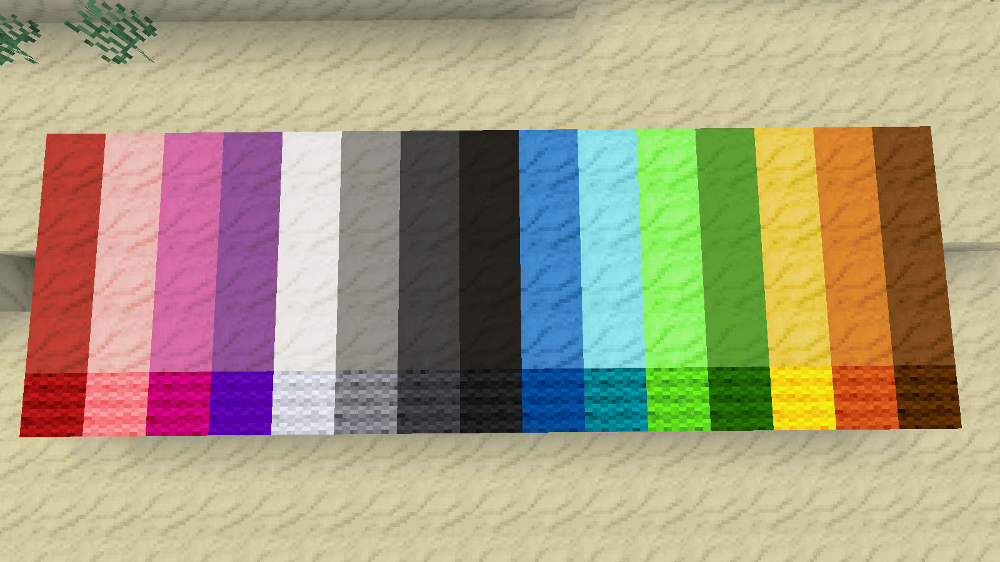

# Colored Sand Mod

## Description
This mod adds decorative dyed variants for the default sand into Minetest/Luanti. Colored sand can be crafted the same way wool can be colored, just put one dye color and a node of sand in the crafting grid, like this:

## Screenshot example

## Bonus use 🙂
You can also make a colorful node bomb with this sand!

